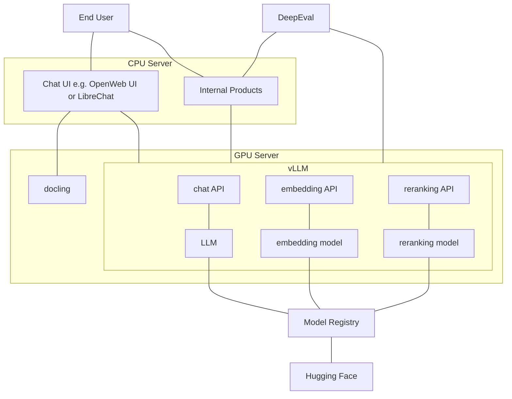
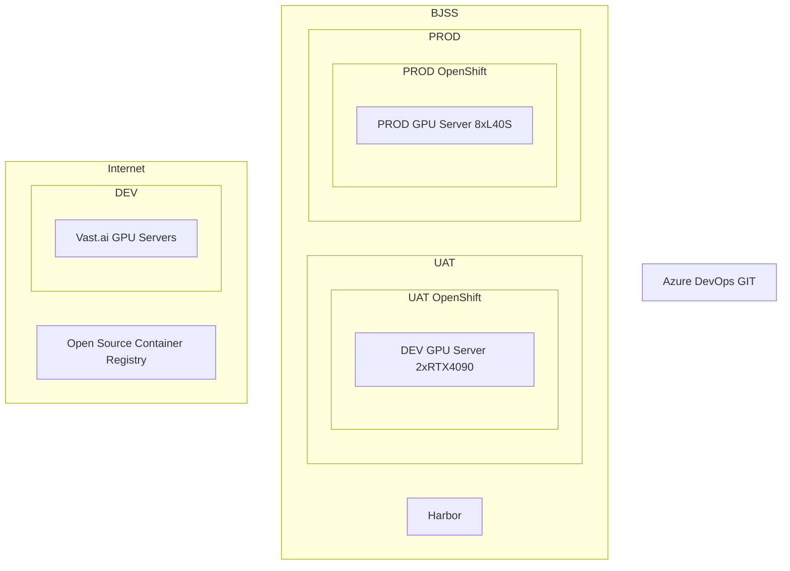

# Light weight Open Source AI platform
This repo should contain a light weight Open Source AI platform, coming with the basic needs to develop and host AI applications fully in house.

## Architecture

### Tool glossary
#### vLLM
vLLM is a famous LLM runner like ollama or Hugging Face TGIF. While ollama is designed for ease of use and is a great tool for end users, vLLM is designed for speed and production workloads. It should outperform ollama by a good margin in terms of inference speed and capacity. It evolved as the industry standard for production LLM inference.

#### OpenWeb UI / LibreChat
OpenWeb UI and LibreChat are open source chat frontends, offering similar capabilities like ChatGPT or Gemini. While OpenWeb UI has a larger user and developer base, it has a weird license. LibreChat on the other hand comes under MIT license.

#### docling
Docling is content extraction tool that uses AI models to preprocess various file formats to make them LLM/RAG ready, by e.g OCR or table extraction. It can improve performance of Chat frontends where users upload all kinds on different documents.

#### DeepEval
DeepEval is a LLM evaluation framework with e.g. LLM as judge implementations that can be used to evaluate LLM systems, when a test data set is present.

## Release process

