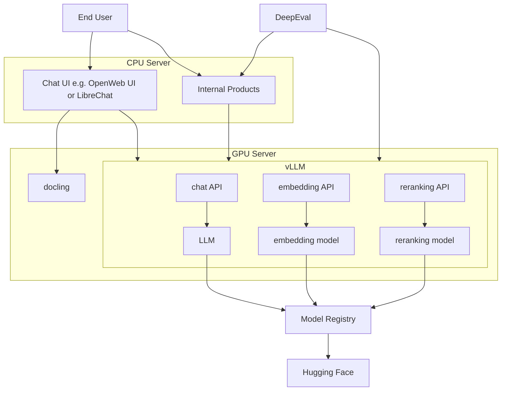

# Light weight Open Source AI platform
This repo should contain a light weight Open Source AI platform, coming with the basic needs to develop and host AI applications fully in house.

## Architecture

### Tool glossary
#### vLLM
vLLM is a famous LLM runner like ollama or Hugging Face TGIF. While ollama is designed for ease of use and is a great tool for end users, vLLM is designed for speed and production workloads. It should outperform ollama by a good margin in terms of inference speed and capacity. It evolved as the industry standard for production LLM inference.

#### OpenWeb UI / LibreChat
OpenWeb UI and LibreChat are open source chat frontends, offering similar capabilities like ChatGPT or Gemini. While OpenWeb UI has a larger user and developer base, it has a weird license. LibreChat on the other hand comes under MIT license.

#### docling
Docling is content extraction tool that uses AI models to preprocess various file formats to make them LLM/RAG ready, by e.g OCR or table extraction. It can improve performance of Chat frontends where users upload all kinds on different documents.

#### DeepEval
DeepEval is a LLM evaluation framework with e.g. LLM as judge implementations that can be used to evaluate LLM systems, when a test data set is present.

## CICD
All tools can be deployed as docker containers.

## Use Case selection template
### Visibility
1. Do we have a catchy name?
1. Does it align with strategic initiatives of the bank/top management?
1. Does the business sponsor show interest in the project?
1. Does it have the potential for follow up projects?
1. Can we quickly develop a PoC?
1. Can we measure the impact?
### Impact
1. What is the current problem or inefficiency?
1. Who is affected and how?
1. How many users are affected?
1. Will it enhance our business?
    1. What is the potential gain?
1. Will it automate our business?
    1. How many people are working on it manually?
    1. How long does it take a human to perform the task?
    1. How often is the task performed?
    1. How much do the people cost that perform the task?
### Feasibility
1. Is it an AI problem?
    1. Can we solve it with normal software engineering?
    1. Is it error forgiving?
1. Can we measure the performance?
1. Can we deliver it to the customer? E.g via web UI or integration in existing tool?
1. Is needed data accessible?
1. Can a Business contact be involved on demand?
1. How complex is it?
1. How many dependencies do we have?
1. How long will it take?
### Risk
1. Is there any compliance risk?
1. Will the problem persist for a long time?

## Open Questions
- Which GPUs are present? 1x RTX???? and 8x L40S?
- How is the compute organized? Kubernetes cluster? Docker host? Plain Server?
- How are apps deployed? Is there a CICD in place?
- Which version control system is used? GitLab?
- Which dev machine will I get? MacBook? VDI? Which specs does it have?
- Do dev machines and Servers have access to the internet to install linux packages and python packages or to download model from hugging face?
- will we face multi modal use cases or just NLP?

