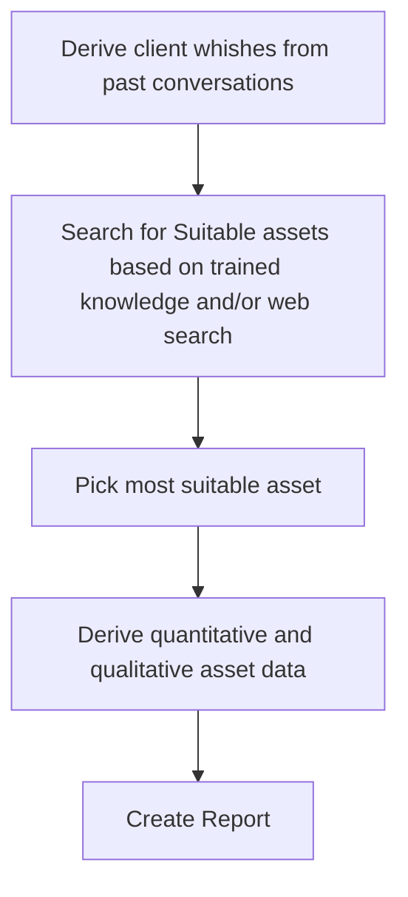

# Architecture
## Input
- past conversations with the client
- quantitative asset data
    - for stocks: volatility, ratings, eps, pe ratio, dividend yield, ...
    - for bonds: yield, duration, ratings, currency, ...
    - for funds: volatility, composition, cost, ...
    - for commodities: volatility, analysis, ...
- qualitative asset data:
    - for stocks: company profile, news, ...
    - for bonds: company profile
    - for funds: fund profile

## Algorithm 
Users should get the possibility to correct mistakes during the process. Via e.g. altering the predefined prompts.

## Output
- A one page long Report containing the investment advice, important data and an explanation on why this asset was picked