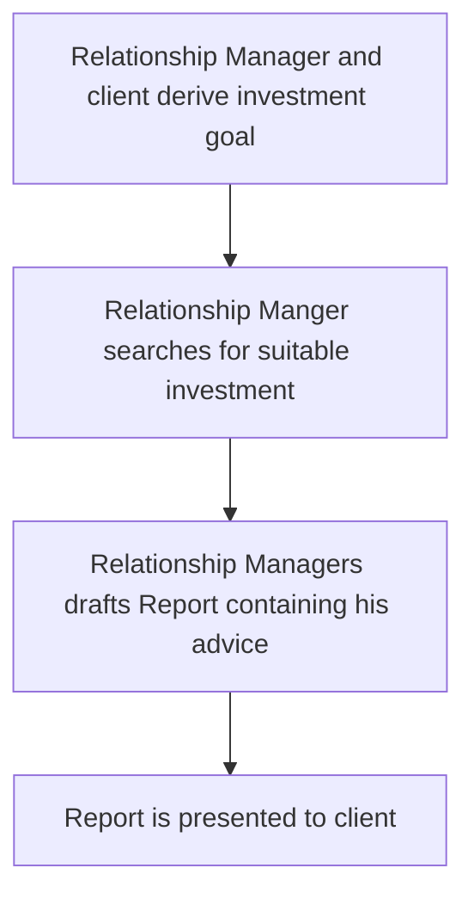

# Investment Research Agent
The Relationship Manager should have an Agent System, which allows him to speed up the client investment advice process.

??? marks that I am at the moment not able to answer the question.

## Workflow to be automated

## Use Case feasibility
### Visibility
1. Do we have a catchy name?  
DeepAdvice, ???
1. Does it align with strategic initiatives of the bank/top management?  
Yes
1. Does the business sponsor show interest in the project?  
Yes
1. Does it have the potential for follow up projects?  
Yes
1. Can we quickly develop a PoC?  
Yes, but as with most GenAI solutions it is easy to create a PoC that creates somewhat reasonable outputs. Unfortunately we will only find out in the end if the quality is good enough.
1. Can we measure the impact?  
Only qualitatively via user feedback.

### Impact
1. What is the current problem or inefficiency?   
Relationship Managers (RM) and Financial Strategy Advisors (FSA) get into client conversations and want to make an investment recommendation to the client. The process of researching a suitable investment is lengthy and it is hard to cover large amounts of information.
1. Who is affected and how?  
The Relationship Managers and Financial Strategy Advisors need to spend ???% of their day in researching suitable investments for their clients needs.
1. Will it enhance our business?  
Yes, but probably only slightly with potentially wider research.
    1. What is the potential gain?  
    Larger coverage of potential investments and therefore potentially a better recommendation.
1. Will it automate our business?  
Yes.
    1. How many people are working on it manually?  
    ???
    1. How long does it take a human to perform the task?  
    ???
    1. How often is the task performed?  
    ???
    1. How much do the people cost that perform the task?  
    ???

### Feasibility
1. Is it an AI problem?  
Yes.
    1. Can we solve it with normal software engineering?  
    Partially, pulling asset key figures is best done programmatically by a tool that is called by the AI workflow.
    1. Is it error forgiving?  
    Yes, since we anyways do not know what the absolute right investment is and a relationship managers will not blindly send out the AI generated information. How ever we need to be clear that this is possibly one of the most important aspects of Safra's business and therefore high standards should be applied.
1. Can we measure the performance?  
Only qualitatively via user feedback.
1. Can we deliver it to the customer? E.g via web UI or integration in existing tool?  
Yes, stand alone UI definitely works.
1. Which Data is needed and is it available?
    - Plenty of asset data e.g. key figures about stocks, bonds, funds, commodities, ...
    - client conversations or their transcripts/notes
    - web access for basic research or good meta data of all kind of potential assets
    - ??? availability atm unclear
1. Who is the Business contact and can he be involved on demand?  
???
1. How complex is it?  
??? Can only be answered after further clarification.
1. How many dependencies do we have?  
??? Can only be answered after further clarification.

### Risk
1. Is there any compliance risk?  
???
1. Will the problem persist for a long time?  
Yes.
1. Is there a MVP (Minimum Viable Product) with reduced scope that is already useful?  
??? Maybe focusing on just one asset class e.g. stocks first.

## Concerns
1. Is the expectation for the tool only to research suitable investments based on client conversations describing their needs? Or do stakeholders maybe have higher (possibly unrealistic expectations)
1. How detailed are the client descriptions? Do clients typically provide such specific wishes as shown in the demo (e.g., “I want to invest in AI infrastructure and increase USD exposure”)? (Source: https://www.unique.ai/en/blog/smarter-investment-advice-in-minutes-meet-our-investment-insights-agent)
1. How much freedom do we want/need to give the user? Can we define a clear AI workflow — e.g., review client conversations → define investment goal → research assets → select asset → cross-check with goal → draft report. A clear workflow would be preferred, as it reduces the risk of poor prompts and unrealistic expectations, leading to safer and more robust usage.
1. The impact is not easy to measure. As a first use case we migth want to pick a use case where we can easily comunicate the impact.

## Conclusion
Further clarification is needed. We should engage with future users and the business sponsor to sketch the architecture and understand their expectations and needs in greater detail.